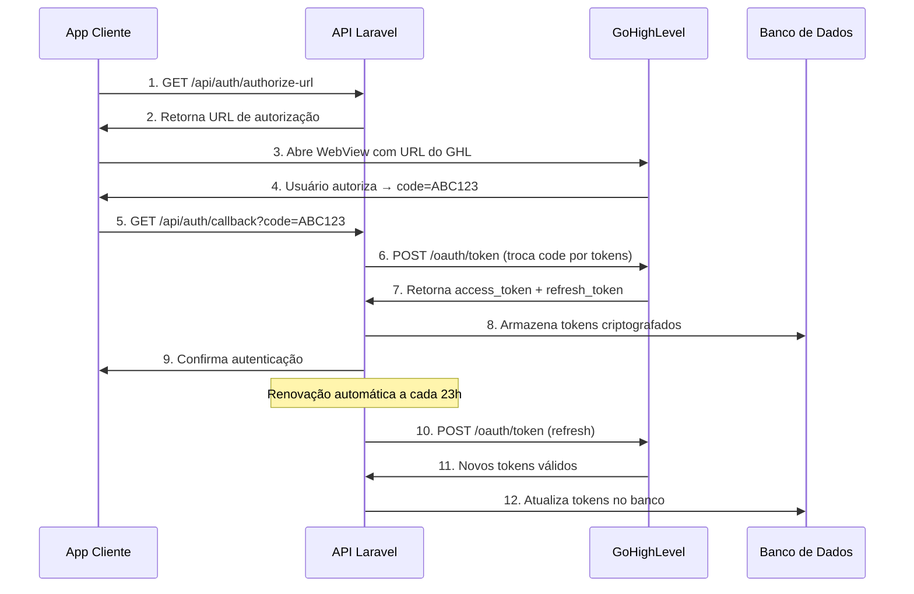
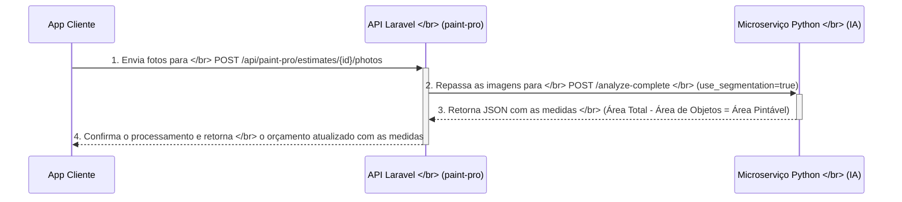

# Documentação Completa do Backend - PaintPro API

Este documento detalha a arquitetura, endpoints, e funcionamento do backend do sistema PaintPro. O backend é composto por uma aplicação monolítica em Laravel que orquestra a lógica de negócio e um microserviço em Python especializado em processamento de imagem.

## 1. Arquitetura Geral

O sistema é baseado em uma arquitetura de serviços distribuídos:

- **API Principal (Backend Laravel)**: Construído com [Laravel 11](https://laravel.com/), serve como o núcleo da aplicação. É responsável pela gestão de orçamentos, lógica de negócio, persistência de dados e atua como um proxy seguro para serviços externos como GoHighLevel (GHL) e o microserviço de IA.
- **Microserviço de IA (Python)**: Construído com [FastAPI](https://fastapi.tiangolo.com/) e OpenCV, é focado em processamento de imagem, análise fotométrica e segmentação semântica.

## 2. Como Executar o Ambiente Local

```bash
docker-compose up -d --build
```

- **API Laravel**: `http://localhost:8000`
- **Microserviço Python**: `http://localhost:8001`

## 3. Estrutura dos Endpoints

Os endpoints são agrupados por domínio de negócio:

| Prefixo                 | Módulo                  | Descrição                                       |
| ----------------------- | ----------------------- | ----------------------------------------------- |
| `/api/auth`             | GoHighLevel             | Autenticação e autorização OAuth2 com o GHL.    |
| `/api/contacts`         | GoHighLevel             | CRUD de contatos diretamente na API do GHL.     |
| `/api/paint-pro`        | PaintPro                | Fluxo principal de criação de orçamentos.       |
| `/api/paint-catalog`    | PaintCatalog            | Gerenciamento e consulta do catálogo de tintas. |
| `/api/image-processing` | ImageProcessing (Proxy) | Endpoints de proxy para o microserviço Python.  |

---

## 4. Autenticação com GoHighLevel (`/api/auth`)

A integração com o GoHighLevel utiliza OAuth2 para autenticação segura. O sistema gerencia automaticamente tokens de acesso, refresh tokens e renovação preventiva para manter a conexão sempre ativa.

### 🔐 **Fluxo OAuth2 Completo**



### 🛡️ **Segurança e Armazenamento**

- **Criptografia**: Tokens são criptografados antes de salvar no banco
- **Location ID**: Cada token está associado a uma location específica do GHL
- **Expiração**: Controle automático de expiração com renovação preventiva
- **Limpeza**: Tokens expirados são removidos automaticamente após 30 dias

### 📱 **Endpoints de Autenticação**

Todas as requisições esperam `Accept: application/json`.

#### `GET /authorize-url`

- **Descrição**: Gera URL de autorização OAuth2 para redirecionar o usuário ao GoHighLevel
- **Fluxo**: Primeiro passo do processo de autenticação
- **Requisição**: `GET /api/auth/authorize-url` (chamada pelo app frontend)
- **Headers**: `Accept: application/json`
- **Resposta**: Redirecionamento 302 para `https://marketplace.gohighlevel.com/oauth/chooselocation`
- **Parâmetros OAuth**: `client_id`, `redirect_uri`, `response_type=code`, `scope=contacts`
- **Uso no App**: App frontend chama este endpoint para obter a URL de autorização e abrir em WebView

#### `GET /callback`

- **Descrição**: Processa o callback do GoHighLevel após autorização do usuário
- **Fluxo**: Segundo passo - troca código por tokens de acesso
- **Requisição**: Query parameter `code` (ex: `?code=ABC123_FROM_GHL`)
- **Processo Interno**:
  1. Valida o código recebido
  2. Faz POST para `https://services.leadconnectorhq.com/oauth/token`
  3. Armazena tokens criptografados no banco
  4. Associa ao `location_id` retornado pelo GHL
- **Resposta de Sucesso (200)**:
  ```json
  {
    "success": true,
    "expires_at": "2024-08-20T12:00:00.000000Z",
    "location_id": "LOCATION_ID_FROM_GHL"
  }
  ```
- **Resposta de Erro (400/500)**:
  ```json
  {
    "success": false,
    "message": "Authorization failed on GoHighLevel side.",
    "error": "invalid_grant"
  }
  ```

#### `GET /status`

- **Descrição**: Verifica o status atual da autenticação e validade dos tokens
- **Uso**: Verificar se o usuário está autenticado antes de usar outros endpoints
- **Requisição**: Nenhuma
- **Resposta de Sucesso (200)**:
  ```json
  {
    "success": true,
    "data": {
      "authenticated": true,
      "expires_at": "2024-08-20T12:00:00.000000Z",
      "expires_in_minutes": 1380,
      "needs_login": false,
      "location_id": "LOCATION_ID_FROM_GHL",
      "is_expiring_soon": false
    }
  }
  ```
- **Resposta Não Autenticado**:
  ```json
  {
    "success": true,
    "data": {
      "authenticated": false,
      "needs_login": true
    }
  }
  ```

#### `POST /refresh`

- **Descrição**: Renova manualmente o `access_token` usando o `refresh_token` armazenado
- **Uso**: Renovação sob demanda (além da automática)
- **Requisição**: Nenhuma (usa tokens armazenados no banco)
- **Processo**:
  1. Busca refresh_token válido no banco
  2. Faz POST para endpoint de refresh do GHL
  3. Atualiza tokens no banco
- **Resposta de Sucesso (200)**:
  ```json
  {
    "success": true,
    "expires_at": "2024-08-21T12:00:00.000000Z"
  }
  ```
- **Resposta de Erro (401)**:
  ```json
  {
    "success": false,
    "needs_login": true
  }
  ```

#### `GET /debug`

- **Descrição**: Retorna estatísticas detalhadas sobre tokens armazenados
- **Uso**: Monitoramento e troubleshooting da autenticação
- **Requisição**: Nenhuma
- **Resposta de Sucesso (200)**:
  ```json
  {
    "success": true,
    "data": {
      "total_tokens": 5,
      "valid": 3,
      "expired": 2,
      "needs_refresh": 1,
      "health_percentage": 60.0
    }
  }
  ```

### 🔄 **Renovação Automática**

O sistema possui um agendador (cron job) que executa automaticamente:

- **Frequência**: A cada 23 horas
- **Comando**: `php artisan ghl:refresh-tokens`
- **Funcionalidade**:
  - Identifica tokens que expiram nas próximas 24h
  - Renova automaticamente usando refresh tokens
  - Remove tokens expirados há mais de 30 dias
  - Logs detalhados para monitoramento

### 📊 **Estrutura do Token no Banco**

```sql
-- Tabela: ghl_tokens
location_id        VARCHAR(255)  -- ID da location no GHL
access_token       TEXT          -- Criptografado
refresh_token      TEXT          -- Criptografado
expires_in         INTEGER       -- Segundos até expiração
token_type         VARCHAR(50)   -- Bearer
scope              JSON          -- Permissões concedidas
additional_data    JSON          -- Dados extras do GHL
token_expires_at   TIMESTAMP     -- Data/hora de expiração
created_at         TIMESTAMP
updated_at         TIMESTAMP
```

### 🚨 **Tratamento de Erros**

- **Token Expirado**: Retorna `needs_login: true` para nova autenticação
- **Refresh Token Inválido**: Força nova autenticação OAuth
- **Erro de Rede**: Logs detalhados para troubleshooting
- **Múltiplas Locations**: Suporte a múltiplas locations do GHL

### 🔧 **Configuração Necessária**

```env
# .env
GHL_CLIENT_ID=your_client_id
GHL_CLIENT_SECRET=your_client_secret
GHL_REDIRECT_URI=http://localhost:3000/oauth/callback/gohighlevel
```

### 📱 **Integração com App Cliente**

```javascript
// Exemplo de uso no app
const authFlow = async () => {
  // 1. Obter URL de autorização
  const authUrl = await fetch("/api/auth/authorize-url");

  // 2. Abrir WebView com URL do GHL
  const webView = openWebView(authUrl);

  // 3. Capturar código do callback
  const code = await captureCallbackCode(webView);

  // 4. Trocar código por tokens
  const result = await fetch(`/api/auth/callback?code=${code}`);

  // 5. Verificar status
  const status = await fetch("/api/auth/status");
};
```

---

## 5. CRUD de Contatos GHL (`/api/contacts`)

Endpoints que atuam como proxy para o CRUD de Contatos do GoHighLevel. **Todos os endpoints requerem autenticação OAuth2 válida.**

#### `GET /`

- **Descrição**: Lista contatos com paginação e filtros
- **Requisição**: `GET /api/contacts` com query params opcionais
- **Query Params**: `limit=10`, `offset=0`, `locationId` (automático via token)
- **Headers**: `Accept: application/json`
- **Resposta de Sucesso (200)**: Retorna a resposta da API do GHL com lista de contatos
- **Resposta de Erro (401)**: Token inválido ou expirado

#### `POST /`

- **Descrição**: Cria um novo contato no GoHighLevel
- **Requisição**: `POST /api/contacts` com `Content-Type: application/json`
- **Body**:
  ```json
  {
    "firstName": "João",
    "lastName": "Silva",
    "email": "joao.silva@exemplo.com",
    "phone": "+5511999999999",
    "locationId": "auto_from_token"
  }
  ```
- **Resposta de Sucesso (201)**: Retorna o contato criado da API do GHL
- **Resposta de Erro (400)**: Dados inválidos ou (401) Token inválido

#### `GET /{contactId}`

- **Descrição**: Obtém detalhes de um contato específico
- **Requisição**: `GET /api/contacts/{contactId}`
- **Resposta de Sucesso (200)**: Retorna o contato completo
- **Resposta de Erro (404)**: Contato não encontrado

#### `PUT /{contactId}`

- **Descrição**: Atualiza um contato existente
- **Requisição**: `PUT /api/contacts/{contactId}` com `Content-Type: application/json`
- **Body**: JSON com campos a serem atualizados
- **Resposta de Sucesso (200)**: Retorna o contato atualizado
- **Resposta de Erro (404)**: Contato não encontrado

#### `DELETE /{contactId}`

- **Descrição**: Remove um contato do GoHighLevel
- **Requisição**: `DELETE /api/contacts/{contactId}`
- **Resposta de Sucesso (200)**: Confirmação de exclusão
- **Resposta de Erro (404)**: Contato não encontrado

---

## 6. Fluxo de Orçamento (`/api/paint-pro`)

Endpoints do fluxo principal da aplicação. **Prefixo**: `/api/paint-pro`.

#### `GET /estimates/dashboard`

- **Descrição**: Retorna dados para o dashboard de orçamentos
- **Requisição**: `GET /api/paint-pro/estimates/dashboard`
- **Headers**: `Accept: application/json`
- **Resposta de Sucesso (200)**:
  ```json
  {
    "success": true,
    "data": {
      "total_estimates": 25,
      "pending": 8,
      "completed": 12,
      "sent": 5,
      "recent_activity": [...]
    }
  }
  ```

#### `GET /estimates`

- **Descrição**: Lista orçamentos com filtros e paginação
- **Requisição**: `GET /api/paint-pro/estimates` com query params opcionais
- **Query Params**: `limit=10`, `offset=0`, `status=pending`, `client_name=João`
- **Headers**: `Accept: application/json`
- **Resposta de Sucesso (200)**:
  ```json
  {
    "success": true,
    "data": {
      "estimates": [
        {
          "id": 1,
          "project_name": "Pintura de Apartamento",
          "client_name": "João da Silva",
          "status": "pending",
          "total_area": 450,
          "created_at": "2024-01-15T10:30:00Z"
        }
      ],
      "pagination": {
        "total": 25,
        "per_page": 10,
        "current_page": 1
      }
    }
  }
  ```

#### `POST /estimates`

- **Descrição**: Cria um novo orçamento
- **Requisição**: `POST /api/paint-pro/estimates` com `Content-Type: application/json`
- **Body**:
  ```json
  {
    "project_name": "Pintura de Apartamento",
    "client_name": "João da Silva",
    "project_type": "residential",
    "client_email": "joao@exemplo.com",
    "client_phone": "+5511999999999"
  }
  ```
- **Resposta de Sucesso (201)**:
  ```json
  {
    "success": true,
    "message": "Estimate created successfully",
    "data": {
      "id": 1,
      "project_name": "Pintura de Apartamento",
      "status": "draft",
      "created_at": "2024-01-15T10:30:00Z"
    }
  }
  ```

#### `GET /estimates/{id}`

- **Descrição**: Obtém detalhes completos de um orçamento
- **Requisição**: `GET /api/paint-pro/estimates/{id}`
- **Headers**: `Accept: application/json`
- **Resposta de Sucesso (200)**:
  ```json
  {
    "success": true,
    "data": {
      "id": 1,
      "project_name": "Pintura de Apartamento",
      "client_name": "João da Silva",
      "status": "photos_uploaded",
      "total_area": 450,
      "paintable_area": 380,
      "photos": [...],
      "materials": [...],
      "total_cost": 1250.00,
      "created_at": "2024-01-15T10:30:00Z"
    }
  }
  ```

#### `PUT /estimates/{id}`

- **Descrição**: Atualiza dados básicos de um orçamento
- **Requisição**: `PUT /api/paint-pro/estimates/{id}` com `Content-Type: application/json`
- **Body**: JSON com campos a serem atualizados
- **Resposta de Sucesso (200)**:
  ```json
  {
    "success": true,
    "message": "Estimate updated successfully",
    "data": {
      /* orçamento atualizado */
    }
  }
  ```

#### `DELETE /estimates/{id}`

- **Descrição**: Exclui um orçamento (apenas se ainda não foi enviado)
- **Requisição**: `DELETE /api/paint-pro/estimates/{id}`
- **Resposta de Sucesso (200)**:
  ```json
  {
    "success": true,
    "message": "Estimate deleted successfully"
  }
  ```

#### `PATCH /estimates/{id}/status`

- **Descrição**: Atualiza o status de um orçamento
- **Requisição**: `PATCH /api/paint-pro/estimates/{id}/status` com `Content-Type: application/json`
- **Body**:
  ```json
  {
    "status": "completed"
  }
  ```
- **Status Possíveis**: `draft`, `photos_uploaded`, `elements_selected`, `completed`, `sent`
- **Resposta de Sucesso (200)**:
  ```json
  {
    "success": true,
    "message": "Estimate status updated successfully",
    "data": {
      /* orçamento atualizado */
    }
  }
  ```

#### `POST /estimates/{id}/photos`

- **Descrição**: **Upload e Processamento de Fotos com IA.** Este é o endpoint central para a análise de imagens. Ele orquestra a comunicação com o microserviço Python para obter medições precisas, já descontando áreas de objetos como portas e janelas.

**Fluxo Detalhado do Processamento:**



**Passo a Passo:**

1. **Envio pelo Cliente**: O app cliente envia as imagens do ambiente para o endpoint do Laravel.
2. **Orquestração no Laravel**: A API Laravel recebe as fotos e as repassa para o microserviço Python, instruindo-o a usar a segmentação semântica para identificar objetos (`use_segmentation=true`). A lista de objetos a serem descontados (`door, window, person...`) é gerenciada internamente pelo Laravel.
3. **Análise da IA**: O serviço Python analisa as imagens, calcula a área total e a área dos objetos detectados, e retorna a **área pintável** (área total - área dos objetos).
4. **Persistência e Resposta**: O Laravel salva essas medidas precisas no banco de dados, associadas ao orçamento, e retorna uma confirmação ao app cliente.

> O cliente final só precisa interagir com este endpoint; toda a complexidade da comunicação entre os serviços é abstraída pelo backend Laravel.

- **Requisição**: `POST /api/paint-pro/estimates/{id}/photos` com `Content-Type: multipart/form-data`
- **Body**: Campo `photos[]` com array de arquivos de imagem (ex: `photos[0]`, `photos[1]`)
- **Resposta de Sucesso (200)**:
  ```json
  {
    "success": true,
    "message": "Photos uploaded and processed successfully",
    "data": {
      "id": 1,
      "total_area": 450,
      "paintable_area": 380,
      "objects_detected": {
        "door": { "count": 2, "area": 35 },
        "window": { "count": 3, "area": 25 },
        "person": { "count": 1, "area": 10 }
      },
      "photos_processed": 3,
      "status": "photos_uploaded"
    }
  }
  ```

#### `POST /estimates/{id}/select-elements`

- **Descrição**: Seleciona tintas e calcula custos baseado na área pintável
- **Requisição**: `POST /api/paint-pro/estimates/{id}/select-elements` com `Content-Type: application/json`
- **Body**:
  ```json
  {
    "use_catalog": true,
    "brand_key": "sherwin_williams",
    "color_key": "pure_white",
    "usage": "interior",
    "size_key": "gallon",
    "coats": 2
  }
  ```
- **Resposta de Sucesso (200)**:
  ```json
  {
    "success": true,
    "message": "Elements selected and costs calculated successfully",
    "data": {
      "materials": [
        {
          "brand": "Sherwin Williams",
          "color": "Pure White",
          "quantity": 2,
          "unit_cost": 45.0,
          "total_cost": 90.0
        }
      ],
      "total_cost": 90.0,
      "labor_cost": 200.0,
      "grand_total": 290.0,
      "status": "elements_selected"
    }
  }
  ```

#### `POST /estimates/{id}/complete`

- **Descrição**: Finaliza o orçamento com cálculos finais
- **Requisição**: `POST /api/paint-pro/estimates/{id}/complete`
- **Resposta de Sucesso (200)**:
  ```json
  {
    "success": true,
    "message": "Estimate completed successfully",
    "data": {
      "id": 1,
      "status": "completed",
      "total_cost": 290.0,
      "valid_until": "2024-02-15T10:30:00Z"
    }
  }
  ```

#### `POST /estimates/{id}/send-to-ghl`

- **Descrição**: Envia o orçamento para o GoHighLevel CRM
- **Requisição**: `POST /api/paint-pro/estimates/{id}/send-to-ghl` com `Content-Type: application/json`
- **Body** (opcional):
  ```json
  {
    "include_photos": true,
    "create_opportunity": true,
    "opportunity_value": 290.0,
    "pipeline_stage": "estimate_sent"
  }
  ```
- **Resposta de Sucesso (200)**:
  ```json
  {
    "success": true,
    "message": "Estimate sent to GHL successfully",
    "data": {
      "ghl_contact_id": "contact_123",
      "ghl_opportunity_id": "opp_456",
      "photos_uploaded": 3,
      "status": "sent"
    }
  }
  ```

---

## 7. Catálogo de Tintas (`/api/paint-catalog`)

Endpoints para interagir com o catálogo de tintas.

#### `GET /brands`

- **Descrição**: Lista todas as marcas disponíveis
- **Requisição**: `GET /api/paint-catalog/brands`
- **Headers**: `Accept: application/json`
- **Resposta de Sucesso (200)**:
  ```json
  {
    "success": true,
    "data": [
      {
        "key": "sherwin_williams",
        "name": "Sherwin Williams"
      },
      {
        "key": "benjamin_moore",
        "name": "Benjamin Moore"
      },
      {
        "key": "ppg",
        "name": "PPG"
      }
    ]
  }
  ```

#### `GET /brands/popular`

- **Descrição**: Lista marcas mais populares
- **Requisição**: `GET /api/paint-catalog/brands/popular`
- **Resposta de Sucesso (200)**: Lista das marcas mais utilizadas

#### `GET /brands/{brandKey}/colors`

- **Descrição**: Lista cores de uma marca específica
- **Requisição**: `GET /api/paint-catalog/brands/{brandKey}/colors?usage=interior`
- **Query Params**: `usage` (opcional: `interior`, `exterior`)
- **Resposta de Sucesso (200)**:
  ```json
  {
    "success": true,
    "data": [
      {
        "key": "pure_white",
        "name": "Pure White",
        "hex_code": "#FFFFFF",
        "usage": ["interior", "exterior"],
        "price_per_gallon": 45.0
      }
    ]
  }
  ```

#### `GET /brands/{brandKey}/colors/{colorKey}`

- **Descrição**: Detalhes completos de uma cor específica
- **Requisição**: `GET /api/paint-catalog/brands/{brandKey}/colors/{colorKey}?usage=interior`
- **Resposta de Sucesso (200)**:
  ```json
  {
    "success": true,
    "data": {
      "key": "pure_white",
      "name": "Pure White",
      "hex_code": "#FFFFFF",
      "rgb": [255, 255, 255],
      "usage": ["interior", "exterior"],
      "coverage": 350,
      "drying_time": "2-4 hours",
      "price_per_gallon": 45.0,
      "available_sizes": ["gallon", "5_gallon"]
    }
  }
  ```

#### `GET /search`

- **Descrição**: Busca em todas as cores e marcas
- **Requisição**: `GET /api/paint-catalog/search?q=pure_white&brand=sherwin_williams`
- **Query Params**: `q` (termo de busca), `brand` (opcional)
- **Resposta de Sucesso (200)**: Lista de cores que correspondem à busca

#### `POST /calculate`

- **Descrição**: Calcula a necessidade de tinta para uma área específica
- **Requisição**: `POST /api/paint-catalog/calculate` com `Content-Type: application/json`
- **Body**:
  ```json
  {
    "brand_key": "sherwin_williams",
    "color_key": "pure_white",
    "usage": "interior",
    "area": 450,
    "coats": 2
  }
  ```
- **Resposta de Sucesso (200)**:
  ```json
  {
    "success": true,
    "data": {
      "gallons_needed": 2.57,
      "gallons_rounded": 3,
      "total_cost": 135.0,
      "coverage_per_gallon": 350,
      "coats": 2
    }
  }
  ```

#### `GET /overview`

- **Descrição**: Retorna uma visão geral do catálogo
- **Requisição**: `GET /api/paint-catalog/overview`
- **Resposta de Sucesso (200)**:
  ```json
  {
    "success": true,
    "data": {
      "total_brands": 15,
      "total_colors": 2500,
      "popular_brands": [...],
      "recent_additions": [...]
    }
  }
  ```

---

## 8. Proxy para Microserviço de Imagem (`/api/image-processing`)

Endpoints que fazem a ponte com o microserviço Python.

#### `GET /health`

- **Descrição**: Verifica o status do microserviço Python
- **Requisição**: `GET /api/image-processing/health`
- **Resposta de Sucesso (200)**:
  ```json
  {
    "success": true,
    "data": {
      "status": "healthy",
      "python_service": "running",
      "redis_cache": "connected",
      "model_loaded": true
    }
  }
  ```

#### `GET /processed`

- **Descrição**: Lista imagens processadas que estão no cache (Redis)
- **Requisição**: `GET /api/image-processing/processed`
- **Resposta de Sucesso (200)**:
  ```json
  {
    "success": true,
    "data": {
      "cached_images": 15,
      "cache_size_mb": 45.2,
      "recent_processing": [...]
    }
  }
  ```

#### `DELETE /cache`

- **Descrição**: Limpa o cache de imagens do Redis
- **Requisição**: `DELETE /api/image-processing/cache`
- **Resposta de Sucesso (200)**:
  ```json
  {
    "success": true,
    "message": "Cache cleared successfully",
    "data": {
      "cleared_items": 15,
      "freed_space_mb": 45.2
    }
  }
  ```

---

## 9. Endpoints Diretos do Microserviço Python (IA)

Endpoints acessíveis diretamente no microserviço Python em `http://localhost:8001`.

#### `GET /`

- **Descrição**: Status do serviço e funcionalidades disponíveis
- **Requisição**: `GET http://localhost:8001/`
- **Resposta de Sucesso (200)**:
  ```json
  {
    "success": true,
    "data": {
      "status": "running",
      "version": "2.1.0",
      "features": ["segmentation", "analysis", "calculation"],
      "model_info": {
        "name": "DeepLabV3+ ResNet50",
        "classes": 67,
        "accuracy": "95.2%"
      }
    }
  }
  ```

#### `GET /health`

- **Descrição**: Verificação de saúde detalhada do serviço
- **Requisição**: `GET http://localhost:8001/health`
- **Resposta de Sucesso (200)**:
  ```json
  {
    "success": true,
    "data": {
      "status": "healthy",
      "python_version": "3.11.0",
      "opencv_version": "4.8.0",
      "torch_version": "2.0.0",
      "redis_connected": true,
      "gpu_available": false,
      "memory_usage_mb": 512
    }
  }
  ```

#### `POST /analyze-complete`

- **Descrição**: Análise fotométrica completa com ou sem segmentação semântica
- **Requisição**: `POST http://localhost:8001/analyze-complete` com `Content-Type: multipart/form-data`
- **Body**:
  - Campo `file`: Arquivo de imagem (obrigatório)
  - Campo `use_segmentation`: `true` ou `false` (padrão: `true`)
  - Campo `segmentation_classes`: String com classes separadas por vírgula (ex: `"door,window,person"`)
- **Resposta de Sucesso (200)**:
  ```json
  {
    "success": true,
    "data": {
      "filename": "image.jpg",
      "total_area_pixels": 1923600,
      "paintable_area_pixels": 1723600,
      "paintable_area_sqm": 43.09,
      "segmentation_results": {
        "door": { "count": 1, "area_pixels": 100000, "area_sqm": 2.5 },
        "window": { "count": 2, "area_pixels": 80000, "area_sqm": 2.0 },
        "person": { "count": 1, "area_pixels": 20000, "area_sqm": 0.5 }
      },
      "processing_time_ms": 1250,
      "cache_hit": false
    }
  }
  ```

#### `POST /semantic-segmentation`

- **Descrição**: Executa apenas a segmentação semântica sem cálculos de área
- **Requisição**: `POST http://localhost:8001/semantic-segmentation` com `Content-Type: multipart/form-data`
- **Body**:
  - Campo `file`: Arquivo de imagem (obrigatório)
- **Resposta de Sucesso (200)**:
  ```json
  {
    "success": true,
    "data": {
      "filename": "image.jpg",
      "segmentation_mask": "base64_encoded_mask",
      "detected_classes": ["door", "window", "person"],
      "processing_time_ms": 850
    }
  }
  ```

#### `GET /segmentation/available-classes`

- **Descrição**: Lista todas as classes que o modelo de IA consegue detectar
- **Requisição**: `GET http://localhost:8001/segmentation/available-classes`
- **Resposta de Sucesso (200)**:
  ```json
  {
    "success": true,
    "data": {
      "total_classes": 67,
      "classes": [
        "person",
        "bicycle",
        "car",
        "motorcycle",
        "airplane",
        "bus",
        "train",
        "truck",
        "boat",
        "traffic light",
        "fire hydrant",
        "stop sign",
        "parking meter",
        "bench",
        "bird",
        "cat",
        "dog",
        "horse",
        "sheep",
        "cow",
        "elephant",
        "bear",
        "zebra",
        "giraffe",
        "backpack",
        "umbrella",
        "handbag",
        "tie",
        "suitcase",
        "frisbee",
        "skis",
        "snowboard",
        "sports ball",
        "kite",
        "baseball bat",
        "baseball glove",
        "skateboard",
        "surfboard",
        "tennis racket",
        "bottle",
        "wine glass",
        "cup",
        "fork",
        "knife",
        "spoon",
        "bowl",
        "banana",
        "apple",
        "sandwich",
        "orange",
        "broccoli",
        "carrot",
        "hot dog",
        "pizza",
        "donut",
        "cake",
        "chair",
        "couch",
        "potted plant",
        "bed",
        "dining table",
        "toilet",
        "tv",
        "laptop",
        "mouse",
        "remote",
        "keyboard",
        "cell phone",
        "microwave",
        "oven",
        "toaster",
        "sink",
        "refrigerator",
        "book",
        "clock",
        "vase",
        "scissors",
        "teddy bear",
        "hair drier",
        "toothbrush"
      ]
    }
  }
  ```
