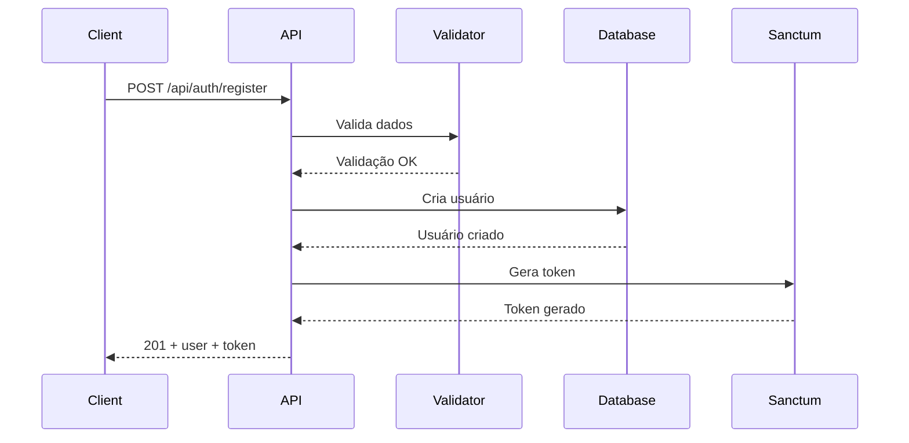
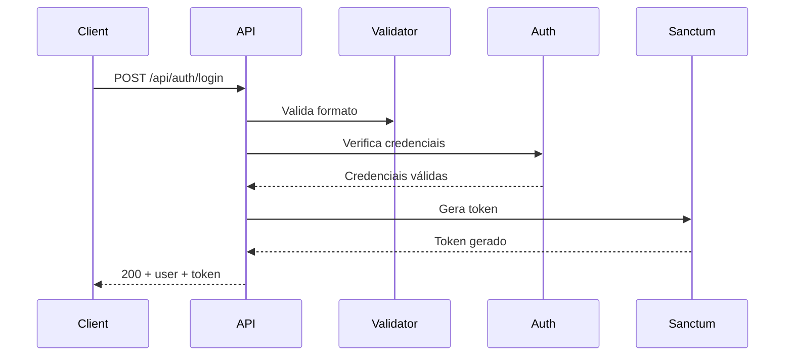
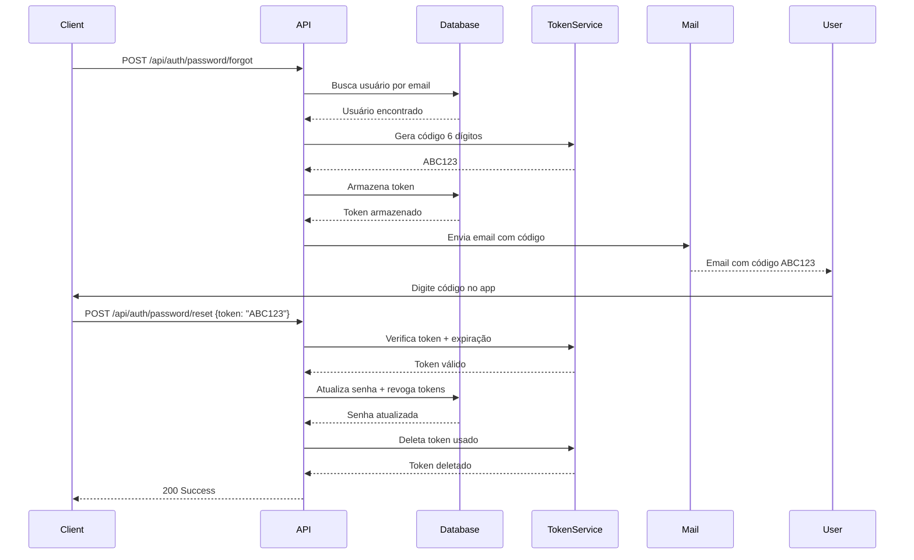

# MÓDULO DE AUTENTICAÇÃO - AUTH_MODULE

## 📌 Visão Geral

Sistema de autenticação baseado em credenciais (email/senha) usando Laravel Sanctum para emissão de tokens de API. Este módulo fornece endpoints REST para registro, login e recuperação de senha.

## 🔗 Links Rápidos
- Controller: `app/Modules/Auth/Controllers/CredentialsAuthController.php`
- Rotas: `routes/api/v1/auth.php`
- Modelo User: `app/Modules/Shared/Models/User.php`
- Requests: `app/Modules/Auth/Requests/`
- Database schema: `docs/database-schema.md`

## 🧱 Componentes Principais

### Arquitetura
```
├── Controllers/
│   └── CredentialsAuthController.php    # Endpoints de autenticação
├── Requests/
│   ├── LoginRequest.php                 # Validação de login
│   ├── RegisterRequest.php              # Validação de registro
│   ├── ForgotPasswordRequest.php        # Validação de forgot password
│   └── ResetPasswordRequest.php         # Validação de reset password
├── Models/
│   └── User.php                         # Modelo de usuário (Shared)
└── Routes/
    └── api/v1/auth.php                  # Rotas de autenticação
```

### Stack Tecnológico
- **Framework:** Laravel 10
- **Autenticação:** Laravel Sanctum (tokens stateless)
- **Validação:** FormRequest (PSR-7)
- **Password Reset:** Laravel Password Broker
- **Rate Limiting:** Custom throttle middleware
- **Database:** PostgreSQL 15

## 1. Estrutura do Banco de Dados

### Tabela `users`

```sql
CREATE TABLE users (
    id BIGSERIAL PRIMARY KEY,
    name VARCHAR(255) NOT NULL,
    email VARCHAR(255) NOT NULL UNIQUE,
    email_verified_at TIMESTAMP NULL,
    password VARCHAR(255) NOT NULL,
    remember_token VARCHAR(100) NULL,

    -- Campos opcionais de integração GoHighLevel
    ghl_location_id VARCHAR(255) NULL UNIQUE,
    ghl_business_id VARCHAR(255) NULL,
    ghl_phone VARCHAR(255) NULL,
    ghl_website VARCHAR(255) NULL,
    ghl_address TEXT NULL,
    ghl_city VARCHAR(255) NULL,
    ghl_state VARCHAR(255) NULL,
    ghl_postal_code VARCHAR(255) NULL,
    ghl_country VARCHAR(255) NULL,
    ghl_description TEXT NULL,
    ghl_last_sync_at TIMESTAMP NULL,

    created_at TIMESTAMP NOT NULL DEFAULT CURRENT_TIMESTAMP,
    updated_at TIMESTAMP NOT NULL DEFAULT CURRENT_TIMESTAMP,

    INDEX idx_users_email (email),
    INDEX idx_users_ghl_location (ghl_location_id)
);
```

### Tabela `password_reset_tokens`

```sql
CREATE TABLE password_reset_tokens (
    email VARCHAR(255) PRIMARY KEY,
    token VARCHAR(255) NOT NULL,
    created_at TIMESTAMP NULL,

    INDEX idx_password_reset_email (email)
);
```

### Tabela `personal_access_tokens` (Sanctum)

```sql
CREATE TABLE personal_access_tokens (
    id BIGSERIAL PRIMARY KEY,
    tokenable_type VARCHAR(255) NOT NULL,
    tokenable_id BIGINT NOT NULL,
    name VARCHAR(255) NOT NULL,
    token VARCHAR(64) NOT NULL UNIQUE,
    abilities TEXT NULL,
    last_used_at TIMESTAMP NULL,
    expires_at TIMESTAMP NULL,
    created_at TIMESTAMP NULL,
    updated_at TIMESTAMP NULL,

    INDEX idx_tokenable (tokenable_type, tokenable_id),
    INDEX idx_token (token)
);
```

## 2. Endpoints de Autenticação

Todos os endpoints estão sob o prefixo `/api/auth` e retornam JSON.

### 2.1 POST /api/auth/register

Cria um novo usuário com credenciais próprias e retorna token Sanctum.

**Rate Limit:** 10 req/5min
**Middleware:** `throttle.custom:auth`

**Request:**
```json
{
  "name": "John Doe",
  "email": "john@example.com",
  "password": "StrongPass123!",
  "password_confirmation": "StrongPass123!"
}
```

**Validação:**
- `name`: required, string, max:255
- `email`: required, email, unique:users, max:255
- `password`: required, string, min:8, confirmed
  - Deve conter: 1 maiúscula, 1 minúscula, 1 número, 1 caractere especial

**Response (201 Created):**
```json
{
  "success": true,
  "message": "User registered successfully",
  "data": {
    "user": {
      "id": 1,
      "name": "John Doe",
      "email": "john@example.com",
      "created_at": "2024-10-01T12:00:00.000000Z",
      "updated_at": "2024-10-01T12:00:00.000000Z"
    },
    "token": "1|abcdef123456789..."
  }
}
```

**Possíveis Erros:**
- **409 Conflict** - Email já cadastrado
- **422 Unprocessable Entity** - Validação falhou
- **429 Too Many Requests** - Rate limit excedido

### 2.2 POST /api/auth/login

Autentica usuário e emite token Sanctum para acesso à API.

**Rate Limit:** 10 req/5min
**Middleware:** `throttle.custom:auth`

**Request:**
```json
{
  "email": "john@example.com",
  "password": "StrongPass123!",
  "remember": false
}
```

**Validação:**
- `email`: required, email
- `password`: required, string
- `remember`: optional, boolean

**Response (200 OK):**
```json
{
  "success": true,
  "message": "Login successful",
  "data": {
    "user": {
      "id": 1,
      "name": "John Doe",
      "email": "john@example.com",
      "created_at": "2024-10-01T12:00:00.000000Z",
      "updated_at": "2024-10-01T12:00:00.000000Z"
    },
    "token": "2|xyz789abc456...",
    "token_type": "Bearer"
  }
}
```

**Possíveis Erros:**
- **401 Unauthorized** - Credenciais inválidas
- **422 Unprocessable Entity** - Validação falhou
- **429 Too Many Requests** - Rate limit excedido

### 2.3 POST /api/auth/password/forgot

Envia email com código de 6 dígitos alfanuméricos para redefinição de senha.

**Rate Limit:** 10 req/5min
**Middleware:** `throttle.custom:auth`

**Request:**
```json
{
  "email": "john@example.com"
}
```

**Validação:**
- `email`: required, email

**Response (200 OK):**
```json
{
  "success": true,
  "message": "Password reset code sent to your email"
}
```

**Comportamento de Segurança:**
- Sempre retorna **200 OK** mesmo para emails não cadastrados (previne enumeração)
- Token de **6 caracteres alfanuméricos** (A-Z, 2-9)
- Exclui caracteres ambíguos (0, O, 1, I)
- Token expira em **60 minutos**
- Apenas 1 token ativo por email (novos substituem antigos)
- **Case-insensitive** (ABC123 = abc123)

**Email Enviado:**
- Assunto: `Password Reset Code - PaintPro`
- Contém código de 6 dígitos: `ABC123`
- Template: `emails.password-reset-code`
- Mailable: `App\Mail\PasswordResetMail`
- Remetente: configurado em `.env` (MAIL_FROM_ADDRESS)

**Exemplo de Código:**
```
Your code: ABC123
Expires in 60 minutes
```

**Possíveis Erros:**
- **422 Unprocessable Entity** - Email inválido
- **429 Too Many Requests** - Rate limit excedido
- **500 Internal Server Error** - Falha ao enviar email

### 2.4 POST /api/auth/password/reset

Redefine senha usando código de 6 dígitos recebido por email.

**Rate Limit:** 10 req/5min
**Middleware:** `throttle.custom:auth`

**Request:**
```json
{
  "email": "john@example.com",
  "token": "ABC123",
  "password": "NewStrongPass123!",
  "password_confirmation": "NewStrongPass123!"
}
```

**Validação:**
- `email`: required, email, exists:users
- `token`: required, string, 6 caracteres alfanuméricos (case-insensitive)
- `password`: required, string, min:8, confirmed
  - Deve conter: 1 maiúscula, 1 minúscula, 1 número, 1 caractere especial

**Response (200 OK):**
```json
{
  "success": true,
  "message": "Password has been reset successfully"
}
```

**Possíveis Erros:**
- **400 Bad Request** - Token inválido ou expirado
  ```json
  {
    "success": false,
    "message": "Invalid or expired token",
    "errors": {
      "token": ["Invalid or expired token"]
    }
  }
  ```
- **422 Unprocessable Entity** - Validação falhou
- **429 Too Many Requests** - Rate limit excedido

**Observações:**
- Token é **case-insensitive** (ABC123 = abc123)
- Token é **deletado após uso bem-sucedido** (one-time use)
- Tokens Sanctum existentes são **revogados automaticamente** (força novo login)
- Token expira em **60 minutos**

## 3. Modelo User

**Arquivo:** `app/Modules/Shared/Models/User.php`

### Atributos Principais

```php
protected $fillable = [
    'name',
    'email',
    'password',
    'ghl_location_id',
    'ghl_business_id',
    'ghl_phone',
    'ghl_website',
    'ghl_address',
    'ghl_city',
    'ghl_state',
    'ghl_postal_code',
    'ghl_country',
    'ghl_description',
    'ghl_last_sync_at',
];

protected $hidden = [
    'password',
    'remember_token',
];

protected $casts = [
    'email_verified_at' => 'datetime',
    'ghl_last_sync_at' => 'datetime',
    'password' => 'hashed',
];
```

### Traits Utilizados
- `HasApiTokens` (Sanctum) - Gerenciamento de tokens API
- `HasFactory` - Factories para testes
- `Notifiable` - Sistema de notificações

### Relacionamentos
- `hasMany(GhlToken::class)` - Tokens GoHighLevel
- `hasMany(GhlContact::class)` - Contatos GHL
- `hasMany(Estimate::class)` - Orçamentos

### Campos GoHighLevel (Opcionais)

Os campos prefixados com `ghl_*` são **opcionais** e podem ser preenchidos posteriormente via integração com GoHighLevel CRM. A autenticação funciona **independentemente** desses campos.

Para gerenciar credenciais GHL:
- Veja: `docs/CONTATOS_MODULE.MD`
- Controller: `app/Modules/GoHighLevel/Controllers/GhlCredentialController.php`

## 4. Validação e Segurança

### 4.1 Requisitos de Senha

Implementados via Laravel validation rules:

```php
'password' => [
    'required',
    'string',
    'min:8',
    'confirmed',
    'regex:/[a-z]/',      // Pelo menos 1 minúscula
    'regex:/[A-Z]/',      // Pelo menos 1 maiúscula
    'regex:/[0-9]/',      // Pelo menos 1 número
    'regex:/[@$!%*#?&]/', // Pelo menos 1 caractere especial
]
```

**Exemplos Válidos:**
- `MyPass123!`
- `SecureP@ssw0rd`
- `Str0ng#Passw0rd`

**Exemplos Inválidos:**
- `password` (sem maiúscula, número ou especial)
- `Pass123` (menos de 8 caracteres)
- `PASSWORD123!` (sem minúscula)

### 4.2 Sistema de Tokens de Reset (6 Dígitos)

**Serviço:** `App\Modules\Auth\Services\PasswordResetTokenService`

**Características:**
- Token de **6 caracteres alfanuméricos** (A-Z, 2-9)
- Exclui caracteres ambíguos: 0 (zero), O (ó), 1 (um), I (i)
- **Case-insensitive** para melhor UX
- Expiração em **60 minutos**
- **One-time use** (deletado após uso bem-sucedido)
- Substitui tokens antigos do mesmo email
- Validação com verificação de expiração

**Exemplo de Token:**
```
ABC123
XYZ789
PQ4T5N
```

**Segurança:**
- Espaço de busca: 32^6 ≈ **1 bilhão de combinações**
- Expiração rápida (60 min)
- Rate limiting (10 req/5min)
- One-time use
- Prevenção de enumeração de emails

**Implementação:**
```php
// Criar token
$token = $tokenService->create($email); // "ABC123"

// Verificar token
$isValid = $tokenService->verify($email, $token); // true/false

// Deletar token
$tokenService->delete($email);

// Limpar expirados
$deleted = $tokenService->deleteExpired();
```

### 4.3 Rate Limiting

Configuração: `config/rate-limiting.php`

```php
'auth' => [
    'max_attempts' => 10,
    'decay_minutes' => 5,
]
```

**Resposta quando limite excedido:**
```json
{
  "success": false,
  "message": "Too many requests. Please slow down.",
  "error_code": "RATE_LIMIT_EXCEEDED",
  "details": {
    "max_attempts": 10,
    "decay_minutes": 5,
    "retry_after_seconds": 243
  }
}
```

### 4.4 Tokens Sanctum

**Características:**
- Stateless (não requerem sessões)
- Armazenados em `personal_access_tokens`
- Hash SHA-256 para segurança
- Não expiram por padrão (configurável)
- Podem ter habilidades (abilities) específicas

**Uso:**
```http
Authorization: Bearer {token}
```

**Configuração de Expiração (opcional):**
```php
// config/sanctum.php
'expiration' => 525600, // minutos (1 ano)
```

### 4.5 Proteção CSRF

**APIs:**
- CSRF **desabilitado** para rotas `/api/*` (stateless)
- Autenticação via Bearer token apenas

**Web:**
- CSRF **habilitado** para rotas web
- Token CSRF em meta tag

### 4.6 Headers de Segurança

Configurados automaticamente:
- `X-Frame-Options: SAMEORIGIN`
- `X-Content-Type-Options: nosniff`
- `X-XSS-Protection: 1; mode=block`

## 5. Fluxos Completos

### 5.1 Fluxo de Registro



### 5.2 Fluxo de Login



### 5.3 Fluxo de Recuperação de Senha (6-Digit Code)



## 6. Uso em Testes

### 6.1 Factories

```php
use App\Modules\Shared\Models\User;

// Factory básica
$user = User::factory()->create();

// Com dados específicos
$user = User::factory()->create([
    'email' => 'test@example.com',
    'password' => bcrypt('password123'),
]);

// Múltiplos usuários
$users = User::factory()->count(10)->create();
```

### 6.2 Testes de Autenticação

```php
use App\Modules\Shared\Models\User;

public function test_user_can_login()
{
    $user = User::factory()->create([
        'email' => 'test@example.com',
        'password' => bcrypt('Password123!'),
    ]);

    $response = $this->postJson('/api/auth/login', [
        'email' => 'test@example.com',
        'password' => 'Password123!',
    ]);

    $response->assertStatus(200)
        ->assertJsonStructure([
            'success',
            'message',
            'data' => ['user', 'token', 'token_type'],
        ]);
}
```

### 6.3 Usando Token em Testes

```php
// Com Sanctum actingAs
$user = User::factory()->create();

$this->actingAs($user)
    ->getJson('/api/user')
    ->assertStatus(200);

// Com token real
$response = $this->postJson('/api/auth/login', [
    'email' => $user->email,
    'password' => 'password',
]);

$token = $response->json('data.token');

$this->withHeader('Authorization', 'Bearer ' . $token)
    ->getJson('/api/estimates')
    ->assertStatus(200);
```

## 7. Middleware Stack

### 7.1 Rotas de Autenticação

```php
Route::prefix('auth')
    ->middleware(['throttle.custom:auth'])
    ->group(function () {
        Route::post('/login', [CredentialsAuthController::class, 'login']);
        Route::post('/register', [CredentialsAuthController::class, 'register']);
        Route::post('/password/forgot', [CredentialsAuthController::class, 'forgotPassword']);
        Route::post('/password/reset', [CredentialsAuthController::class, 'resetPassword']);
    });
```

### 7.2 Rotas Protegidas

```php
Route::middleware(['auth:sanctum', 'user.ownership'])
    ->get('/user', function (Request $request) {
        return $request->user();
    });
```

**Middleware aplicado:**
- `auth:sanctum` - Autenticação via Sanctum
- `user.ownership` - Garante que usuário acessa apenas seus dados
- `throttle.custom:*` - Rate limiting customizado

## 8. Comandos Úteis

### 8.1 Artisan Commands

```bash
# Limpar tokens expirados (se configurado expiration)
php artisan sanctum:prune-expired

# Criar usuário via tinker
php artisan tinker
>>> User::create([
    'name' => 'Test User',
    'email' => 'test@example.com',
    'password' => bcrypt('Password123!')
]);

# Listar todos os tokens
>>> \Laravel\Sanctum\PersonalAccessToken::all();

# Revogar todos os tokens de um usuário
>>> User::find(1)->tokens()->delete();
```

### 8.2 Database Commands

```bash
# Rodar migrations
php artisan migrate

# Resetar banco e reexecutar migrations
php artisan migrate:fresh

# Com seeders
php artisan migrate:fresh --seed
```

## 9. Configuração do Ambiente

### 9.1 Variáveis Obrigatórias (.env)

```env
APP_KEY=base64:...
APP_URL=http://localhost:8080

# Database
DB_CONNECTION=pgsql
DB_HOST=127.0.0.1
DB_PORT=5432
DB_DATABASE=paint_pro_db
DB_USERNAME=paint_pro_user
DB_PASSWORD=paint_pro_password

# Mail (para recuperação de senha)
MAIL_MAILER=smtp
MAIL_HOST=smtp.mailtrap.io
MAIL_PORT=2525
MAIL_USERNAME=your_username
MAIL_PASSWORD=your_password
MAIL_ENCRYPTION=tls
MAIL_FROM_ADDRESS=noreply@paintpro.com
MAIL_FROM_NAME="${APP_NAME}"

# Sanctum
SANCTUM_STATEFUL_DOMAINS=localhost,127.0.0.1
SESSION_DRIVER=cookie
```

### 9.2 Configuração de Mail (Desenvolvimento)

**Opção 1: Mailtrap**
```env
MAIL_MAILER=smtp
MAIL_HOST=smtp.mailtrap.io
MAIL_PORT=2525
MAIL_USERNAME=your_mailtrap_username
MAIL_PASSWORD=your_mailtrap_password
```

**Opção 2: Log (apenas para testes)**
```env
MAIL_MAILER=log
```

**Opção 3: Mailhog (Docker)**
```env
MAIL_MAILER=smtp
MAIL_HOST=mailhog
MAIL_PORT=1025
MAIL_ENCRYPTION=null
```

## 10. Troubleshooting

### 10.1 Problema: Token não funciona

**Sintomas:**
```json
{
  "message": "Unauthenticated."
}
```

**Soluções:**
1. Verifique o header: `Authorization: Bearer {token}`
2. Confirme que o token não foi revogado
3. Verifique se o usuário não foi deletado
4. Limpe cache: `php artisan config:clear`

### 10.2 Problema: Rate limit atingido

**Sintomas:**
```json
{
  "message": "Too many requests. Please slow down.",
  "error_code": "RATE_LIMIT_EXCEEDED"
}
```

**Soluções:**
1. Espere o tempo indicado em `retry_after_seconds`
2. Use IPs diferentes em testes
3. Ajuste configuração em `config/rate-limiting.php`
4. Desabilite rate limit em testes: `$this->withoutMiddleware()`

### 10.3 Problema: Email não chega

**Soluções:**
1. Verifique configuração de email em `.env`
2. Confira logs em `storage/logs/laravel.log`
3. Teste conexão SMTP: `php artisan tinker` → `Mail::raw('test', fn($m) => $m->to('test@test.com')->subject('test'));`
4. Use Mailtrap/Mailhog em desenvolvimento
5. Verifique fila se usando `queue`: `php artisan queue:work`

### 10.4 Problema: Senha não atende requisitos

**Sintomas:**
```json
{
  "success": false,
  "errors": {
    "password": [
      "The password format is invalid."
    ]
  }
}
```

**Solução:**
Senha deve ter:
- Mínimo 8 caracteres
- Pelo menos 1 letra maiúscula
- Pelo menos 1 letra minúscula
- Pelo menos 1 número
- Pelo menos 1 caractere especial (@$!%*#?&)

### 10.5 Problema: Migration falha

**Sintomas:**
```
SQLSTATE[42P07]: Duplicate table: 7 ERROR:  relation "users" already exists
```

**Soluções:**
1. Dropar todas as tabelas: `php artisan migrate:fresh`
2. Ou rodar apenas novas migrations: `php artisan migrate`
3. Verificar se migration já foi rodada: `php artisan migrate:status`

## 11. Boas Práticas

### 11.1 Segurança

✅ **Faça:**
- Sempre use HTTPS em produção
- Configure expiração de tokens Sanctum
- Implemente 2FA para operações sensíveis
- Use `bcrypt` ou `Hash::make()` para senhas
- Valide entrada do usuário com FormRequests
- Log tentativas de login falhadas

❌ **Não faça:**
- Armazenar senhas em plain text
- Retornar senha em respostas JSON
- Desabilitar rate limiting em produção
- Usar tokens Sanctum em URLs (query params)
- Expor informações sensíveis em logs

### 11.2 Performance

✅ **Faça:**
- Use eager loading para relacionamentos
- Cache queries frequentes
- Use índices em colunas de busca (email)
- Pagine listagens grandes
- Use Redis para sessions em produção

❌ **Não faça:**
- N+1 queries (use `with()`)
- Carregar todos os usuários de uma vez
- Fazer queries no loop
- Armazenar sessions em banco sem índice

### 11.3 Testes

✅ **Faça:**
- Testar todos os endpoints de auth
- Testar validações
- Testar rate limiting
- Usar factories para dados de teste
- Limpar dados após testes (RefreshDatabase)

❌ **Não faça:**
- Usar dados de produção em testes
- Pular testes de validação
- Hard-code valores sensíveis
- Depender de ordem de execução

## 12. Changelog

### v1.1.0 (2024-10-01) - Token de 6 Dígitos
- ✅ **Sistema de tokens de reset customizado**
  - Token de 6 caracteres alfanuméricos (A-Z, 2-9)
  - Case-insensitive para melhor UX
  - Exclui caracteres ambíguos (0, O, 1, I)
  - Expiração em 60 minutos
  - One-time use (auto-delete após uso)
- ✅ **Novo serviço:** `PasswordResetTokenService`
- ✅ **Mailable customizado:** `PasswordResetMail`
- ✅ **Template HTML profissional** para email
- ✅ **Revogação automática de tokens Sanctum** após reset
- ✅ **14 novos testes** (12 unit + 2 feature)
- ✅ **Documentação atualizada** com fluxos e exemplos

### v1.0.0 (2024-09-29)
- ✅ Implementação inicial com credenciais
- ✅ Endpoints: register, login, forgot password, reset password
- ✅ Integração Sanctum
- ✅ Rate limiting customizado
- ✅ Validação de senha forte
- ✅ Suporte a campos opcionais GHL
- ✅ Remoção completa do fluxo OAuth

### Melhorias Futuras
- [ ] Verificação de email (email verification)
- [ ] 2FA (Two-Factor Authentication)
- [ ] Social login (Google, Apple)
- [ ] Refresh token support
- [ ] Device management (listar/revogar dispositivos)
- [ ] Login history tracking
- [ ] Scheduled task para limpar tokens expirados
